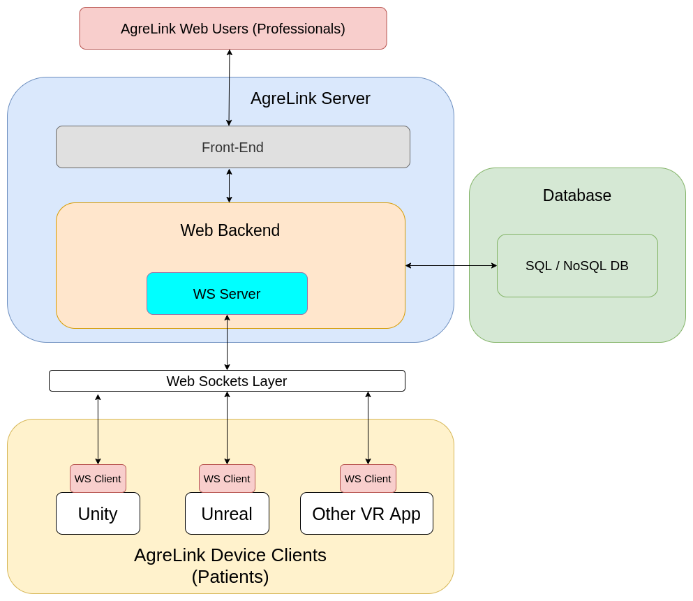

# AgreLink

## Introduction

Welcome to the AgreLink repository! The objective of this project is to create an automated web server to collect and process the results of specific virtual reality exercises of people with acquired brain damage. The idea is to help the professionals who attend the patients to create specific exercises depending on the pathology of the patient, allowing them to innovate in new therapeutic processes taking advantage of the immersion offered by the virtual reality devices, forgetting the cumbersome task of processing and keeping a record of all the results obtained during the sessions, while allowing them to maintain an exhaustive monitoring of the patient's evolution through a pleasant web interface.

At the same time, every exercise can be customized with a default difficulty preset (easy, medium, difficult, etc) or just by tweaking each exercise parameter on the fly, allowing the professionals to launch unexpected events to the patients to check how
they react to them, making it fully customizable for each patient.

## Features

* Complete decoupling between the web server and the virtual reality devices.
* Automated results recollection.
* Multi-engine compatibility while development.
* No VR headset restriction to access the system.
* Rich exercise catalog.
* Easy exercise personalization with difficulty range or custom parameter modification.
* Modify exercise conditions while being done (professionals can run unexpected events for example).
* Clean and simple web interface for professionals.

## Architecture

## Home Page

[Visit us!](http://178.62.244.104:5000/)

